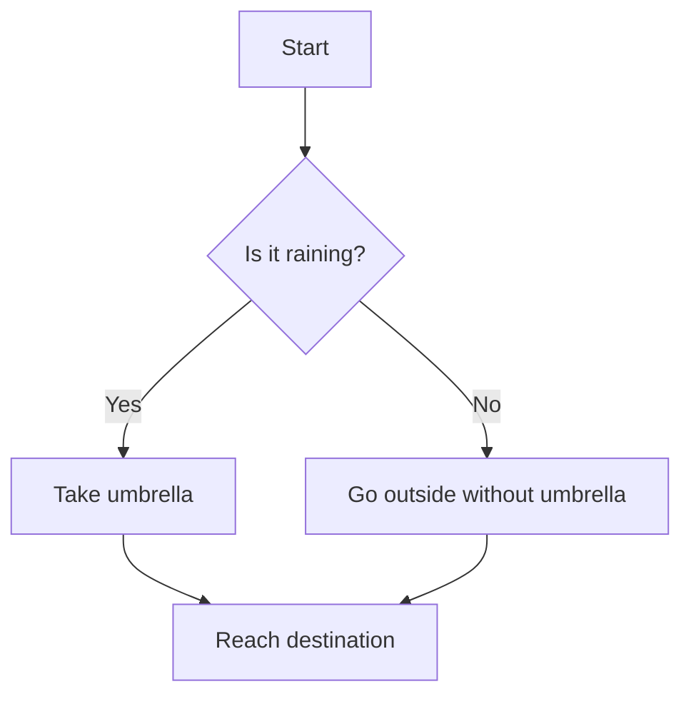
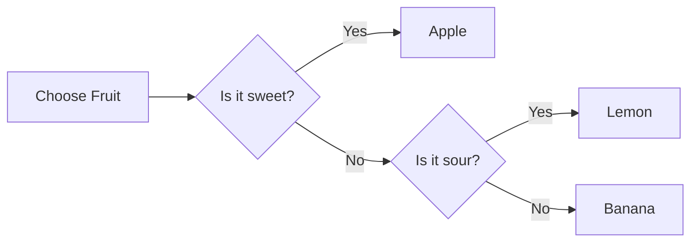
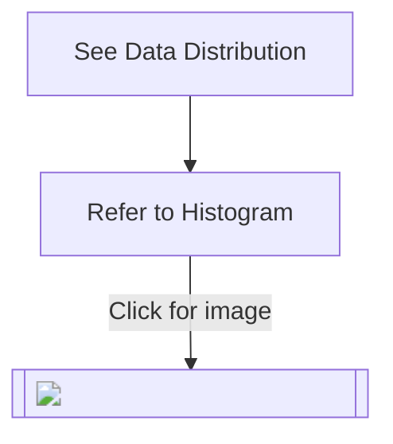

You can include markdown formatting in your posts here to test how it would look. Here’s how you can use some basic markdown for testing:

Text Styling:
- Bold: **This text is bold**
- Italic: *This text is italic*
- Strikethrough: ~~This text is struck through~~

Headings:
# Heading 1
## Heading 2
### Heading 3

Lists:
Unordered List:
```markdown
- Item 1
- Item 2
  - Subitem 2.1
  - Subitem 2.2
```
Ordered List:
```markdown
1. First item
2. Second item
   1. Subitem 2.1
   2. Subitem 2.2
```
Links:
[Link text](URL here): [Google](https://www.google.com)

Images:
: 

Code Blocks:
For inline code: `Use print("Hello, World!")` for a basic print statement.

For code blocks:
```python
def hello_world():
    print("Hello, World!")
```

Here are some examples formatted:

Bold and Italic:
**This is bold text**, and *this is italic text*.

Headings:
# This is Heading 1
## This is Heading 2
### This is Heading 3

Lists:
- First item
- Second item
  - Sub-item

1. First ordered item
2. Second ordered item
   1. First sub-item

Links:
Google's Homepage

Images:
Python Logo

Code Block:
```python
def example_function():
    print("This is an example function")
```
Feel free to try these out in your message, and you'll see how they render. Remember, the actual rendering might depend on the platform or interface where the markdown is being displayed.


In this conversation format, you can't directly "graph" data in the traditional sense. However, you can represent graphical data using certain markdown features:

1. ASCII Art:
For very simple representations, you might use ASCII characters:
```markdown
   *
  ***
 *****
*******
```

   *
  ***


This could represent a simple shape or trend, like a mountain or a bell curve.

2. Markdown Table:
You can create tables to represent data points, which could serve as a rudimentary form of a graph:

| Time | Value |
|------|-------|
|   0  |   1   |
|   1  |   3   |
|   2  |   2   |
|   3  |   4   |


3. Mermaid for Diagrams:
If the platform supports it, you can use Mermaid syntax within markdown code blocks to depict flowcharts, sequence diagrams, or even simple graphs:

markdown


Yes, it is possible to graph flow charts using Mermaid. Mermaid is designed to generate diagrams and visualizations from text-based descriptions. Here's how you can create a flow chart using Mermaid syntax:

Basic Flow Chart:


This will render a simple flow chart where:

- `TD` specifies the direction of the flow from Top to Down.
- `A`, `B`, `C`, `D`, and `E` are nodes in the flow chart.
- `-->` and `--` are used to connect nodes. The latter with text allows for conditional or labeled edges.

More Complex Flow Chart:
You can also create more complex structures:



This one goes Left to Right (`LR`) and includes decision points:

Mermaid Features for Flow Charts:
- Node Shapes: You can use square brackets for rectangles `[ ]`, curly braces for rhombus `{ }`, and parentheses for circles `( )`.
- Direction: `TD` or `TB` for top-down, `LR` for left-right, `RL` for right-left, BT for bottom-top.
- Links: Use `-->` for links without text, `--` Text `-->` for links with text.
- Subgraphs: You can group nodes into subgraphs to represent different sections or components of your system.
- Styling: You can also style edges and nodes using specific syntax or CSS.

Usage Tips:
- Environment: Mermaid works in environments that support rendering Mermaid diagrams, like GitHub READMEs, some markdown editors, or when used in conjunction with JavaScript in web projects.
- Tools: Online editors like Mermaid Live Editor can help visualize your diagrams before integrating them into your documentation.

Remember, the actual rendering depends on the platform or tool you're using. Not all markdown parsers or viewers will support Mermaid out of the box, so you might need to check compatibility or use a specific Mermaid-enabled viewer or editor.



However, support for Mermaid would depend on the text platform or editor you're using; not all markdown viewers support it.

4. Textual Description:
For more complex graphs or when visual representation isn't possible, you can describe the graph:

"The line graph shows an upward trend from point (0,1) to (3,4), with a dip at point (2,2)."

Limitations:
No Dynamic or Interactive Graphs: Unlike actual graphing software or web-based tools, here you're limited to static representations or descriptions.
Platform Dependency: The ability to render complex diagrams like those from Mermaid depends on whether the markdown parser supports it.

Best Practice:
If you're working on or discussing a project, you might want to share actual graphs through a link (like to a Jupyter notebook, Google Colab, or a GitHub repo with images) or embed images directly if the platform allows.
For quick, informal representations, ASCII art or tables might suffice for basic concepts.

Remember, while markdown can describe or outline graphical data, for actual data visualization, you would typically need to use specialized tools or export images from graphing software.